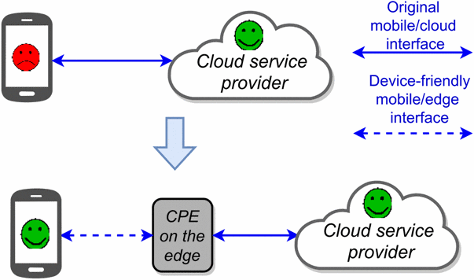
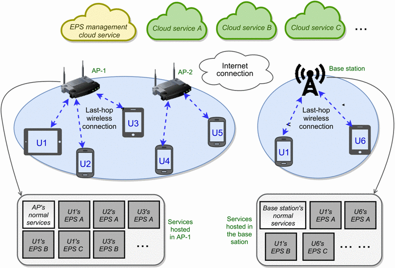

# Edge-based web Traffic Adaptation(ETA) #

We introduce communication/processing entities on network edge (e.g., WiFi access points, cellular base stations, dedicated edge servers) between mobile devices and service providers, such that device-friendly interfaces (e.g., communication protocol with small bandwidth requirement, traditional DFS-like file management for mobile devices) can be enabled between mobile devices and the edge, while keeping the original cloud-friendly mobile device/cloud interfaces for the service providers.

# Edge-Hosted Personal Service(EPS) #

We propose Edge-hosed Personal Service (EPS), an edge-assisted mobile-cloud computing architecture, where different computation/processing entities (called EPS instances) are running on network edge to provide different functionalities for individual users. Figure 2 shows an example scenario of EPS architecture. We implement our ETA based on the idea of EPS. The figure below show the high level idea.

# Device component #

[Device_client](./device_client) intercepts all of the packats send out from the target applications(e.g. GoogleDoc), transforms them to more concise and effienct ETA packet, then redirects them to edge server.
It also reconstructs the ETA packet received from Edge component to the packet that can be recognized by local application.

# Edge component #

[Edge_server](./edge_server) receives ETA packets from device component, and reconstruct the packets to original packet then sends to cloud servers. And do the reverse when receive packet from cloud server.
